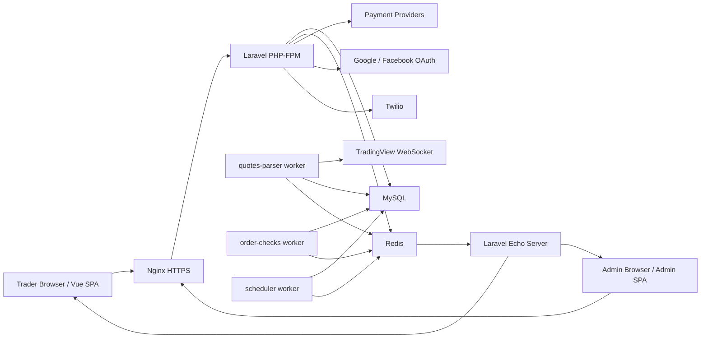
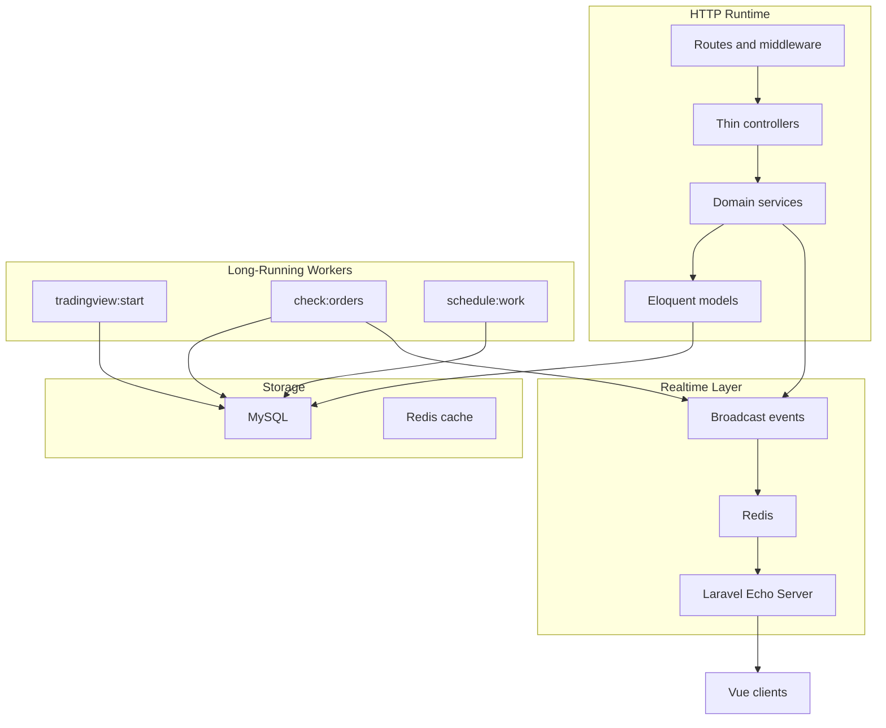
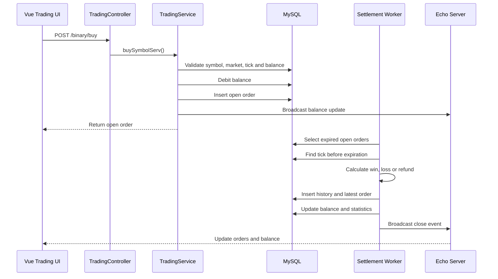
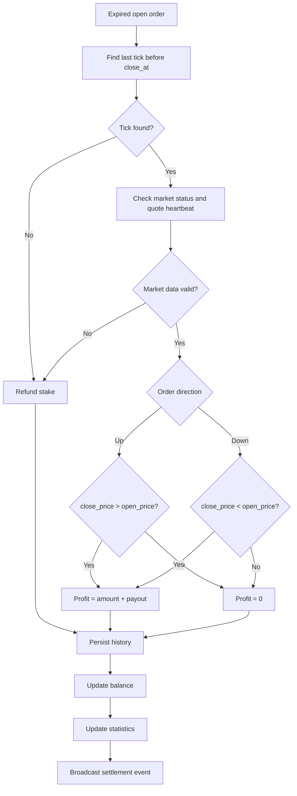
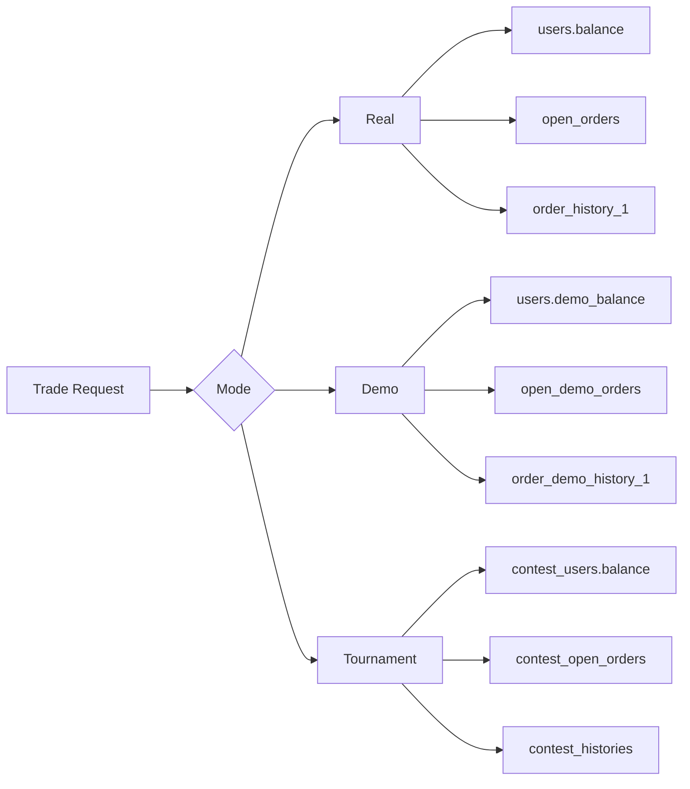
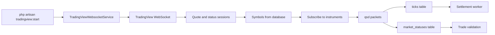
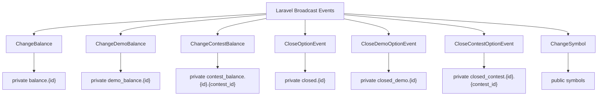
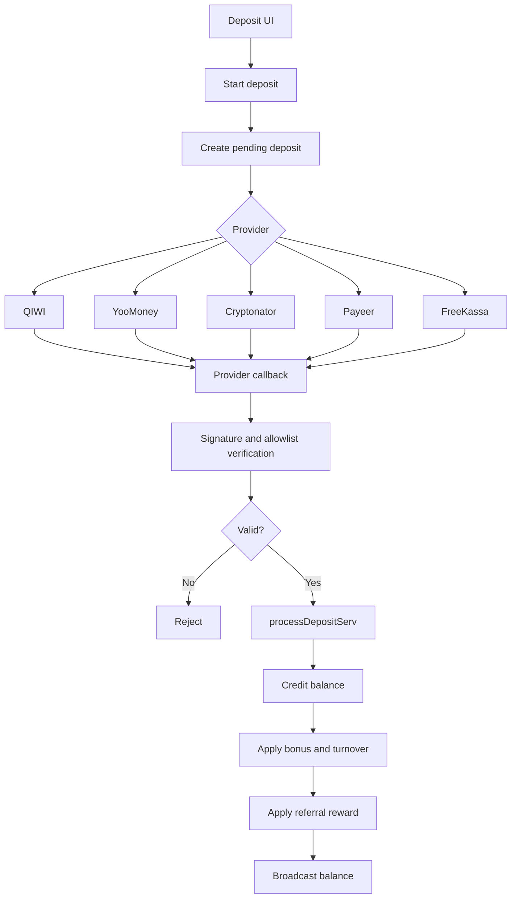
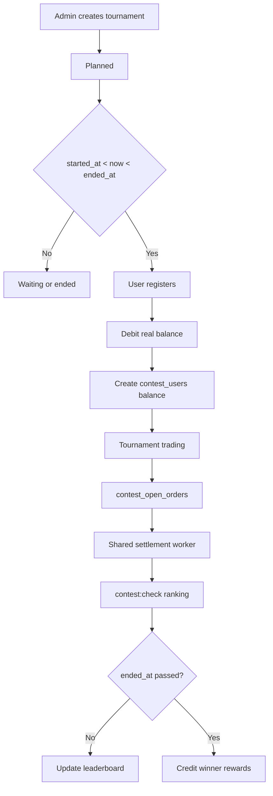

# BinaryOptionsCMS

Full-stack realtime trading platform for binary options, built as a Laravel and Vue application with dedicated workers for market data ingestion, order settlement, realtime notifications, payments, tournaments, KYC and administrative operations.

This repository represents a complete product architecture rather than a simple trading UI. It combines a user-facing trading terminal, an operational admin panel, background settlement services, payment-provider callbacks, dynamic payout management, private websocket events and risk-control workflows.

## Executive Summary

BinaryOptionsCMS is a monolith-first financial platform with separated runtime responsibilities. The Laravel application owns the domain model and HTTP/API surface, while long-running workers handle realtime quote ingestion, option settlement and scheduled maintenance. Vue powers the trading and admin interfaces, TradingView Charting Library provides the market terminal experience, and Laravel Echo Server delivers account and order updates in realtime.

The system was designed around several high-value product requirements:

- accept binary option trades only when symbol, market, expiration and account rules pass;
- ingest live quote data from TradingView through persistent websocket sessions;
- settle expired options against timestamped tick data outside the HTTP request lifecycle;
- keep balances, open positions and close results synchronized without polling;
- support real, demo and tournament trading modes;
- process deposits through multiple payment providers;
- enforce verification, turnover and anti-fraud constraints before withdrawals;
- give administrators operational controls over symbols, users, balances, payouts, KYC, tournaments and payment systems.

## Product Surface

| Area | Capabilities |
| --- | --- |
| Trading terminal | Real/demo/tournament trading, TradingView chart, expiration controls, dynamic payouts, open and latest orders |
| Market data | TradingView websocket ingestion, tick storage, market status tracking, historical bar loading |
| Settlement engine | Expiration scan, close-price lookup, win/loss/refund calculation, history records, balance updates |
| Realtime updates | Private balance channels, close-order channels, symbol payout broadcasts |
| Finance | Deposits, withdrawals, payment callbacks, exchange-rate conversion, bonus turnover |
| Growth | Promocodes, referral tracking, partner requests and reward accounting |
| Tournaments | Registration, isolated contest balance, tournament orders, ranking, rewards |
| Admin panel | User control, symbol configuration, KYC, deposits, payouts, settings, statistics |
| Security controls | Auth, admin middleware, CSRF, private channel authorization, IP/user-agent tracking, ban states |

## Screenshots

Screenshots are stored in `docs/screenshots`. The `docs/` directory is intentionally ignored by Git because it is used as a private documentation and O-1 evidence package. The links below render in local Markdown viewers when the screenshot folder exists.

### Trading And Admin Views

<p>
  
  
</p>

<p>
  

</p>

### Supporting Product Screens

<p>
  
  

</p>

<p>
  
  
</p>

## High-Level Architecture



## Runtime Decomposition

The platform keeps the codebase cohesive but separates runtime responsibilities into dedicated long-running processes.



## Trade Lifecycle



## Order Settlement Engine



## Trading Modes



## Market Data Pipeline



## Realtime Event Model



## Payment Flow



## Tournament Lifecycle



## Core Backend Modules

| Module | Responsibility |
| --- | --- |
| `app/Services/MainHttp/TradingService.php` | Trade placement, open/latest orders, history, demo balance |
| `app/Services/Console/TradingViewWebsocketService.php` | TradingView quote ingestion and market status updates |
| `app/Services/Console/CheckOrdersForCloseService.php` | Expired order settlement and statistics updates |
| `app/Services/Console/SetSymbolsPercentService.php` | Dynamic payout recalculation |
| `app/Services/MainHttp/DepositService.php` | Deposit creation, provider callbacks, bonuses, referral credit |
| `app/Services/MainHttp/WithdrawalService.php` | Withdrawal requests, balance and KYC checks |
| `app/Services/MainHttp/ContestService.php` | Tournament registration, balances, rankings and histories |
| `app/Services/Admin/*` | Operational administration, KYC, users, symbols, payments, settings |

## Technology Stack

| Layer | Technologies |
| --- | --- |
| Backend | PHP 8, Laravel 8, Eloquent, Laravel Passport |
| Frontend | Vue 2, Vue Router, Bootstrap Vue, Axios, i18n |
| Charts | TradingView Charting Library, custom JavaScript datafeed |
| Realtime | Laravel Broadcasting, Redis, Laravel Echo Server, Socket.IO |
| Storage | MySQL, Redis, PostgreSQL config, ClickHouse config |
| Workers | Laravel Artisan commands, scheduler, Docker services |
| Payments | QIWI, YooMoney, Cryptonator, Payeer, FreeKassa |
| Integrations | Google OAuth, Facebook OAuth, Twilio, GeoIP, CBR rates |
| Build | Laravel Mix, Webpack, npm |
| Infrastructure | Docker Compose, Nginx, PHP-FPM |

## Operational Processes

| Command | Role |
| --- | --- |
| `php artisan tradingview:start` | Starts persistent quote parsing from TradingView |
| `php artisan check:orders` | Starts settlement loop for expired orders |
| `php artisan schedule:work` | Runs scheduled maintenance tasks |
| `php artisan clear:ticks` | Removes old tick data |
| `php artisan set:percent` | Recalculates symbol payout percentages |
| `php artisan exchange:rate` | Updates exchange rates |
| `php artisan contest:check` | Updates tournament ranking and rewards |
| `laravel-echo-server start` | Starts realtime event gateway |

## Why This Project Is O-1 Relevant

The project demonstrates engineering work across several complex areas that are usually separated across multiple teams:

- realtime financial UI with charting and websocket-driven updates;
- market data ingestion through a non-trivial websocket protocol;
- deterministic order settlement based on tick timestamps;
- financial account state transitions for real, demo and contest balances;
- payment callback verification across multiple providers;
- bonus and turnover accounting;
- private realtime event authorization;
- operational administration for users, symbols, KYC, payouts and contests;
- background workers and scheduler-driven maintenance;
- Dockerized deployment with separate runtime roles.

Strong article framing:

> I designed and implemented a realtime trading platform architecture that separated user-facing HTTP flows from market data ingestion and order-settlement workers. The platform accepted trades only after validating market state, symbol configuration, account balance and expiration rules, then settled expired options against timestamped tick data and synchronized balances through private realtime channels.

## Repository Structure

```text
app/
  Console/Commands        Artisan entrypoints for workers and scheduler tasks
  Events                  Broadcast events for balances, symbols and order closes
  Http/Controllers        Main, Admin, Auth and SPA controllers
  Http/Middleware         Auth, admin, locale and anti-fraud middleware
  Http/Requests           FormRequest validation classes
  Models                  Eloquent domain models
  Services                MainHttp, Admin and Console service layers

resources/
  vuejs                   User and admin Vue applications
  assets/js               TradingView datafeed and streaming integration
  views                   Blade layouts and panels

routes/
  web.php                 Main application, SPA, payment callback and admin routes
  api.php                 Passport API auth routes
  channels.php            Broadcast channel authorization

database/
  migrations              Domain schema evolution

env-ci/
  local, prod             Docker Compose environments and service Dockerfiles
```

## Private Documentation Package

The `docs/` directory is ignored by Git and can be used for private O-1 materials:

- architecture writeups;
- article drafts;
- screenshots;
- exported diagrams;
- evidence packages;
- translated summaries.

Current local documentation files:

- `docs/architecture-o1.md`
- `docs/technical-diagrams-o1.md`
- `docs/screenshots/*`

Because `docs/` is ignored, these files remain local unless they are manually copied into a separate portfolio package or uploaded somewhere public.

## Notes

This codebase is an older production-style Laravel application. Some implementation details reflect historical constraints and product iteration speed. The architecture is best evaluated by its end-to-end product scope: realtime trading, settlement, payments, tournaments, administration, KYC, anti-fraud controls and operational workers integrated into one platform.

